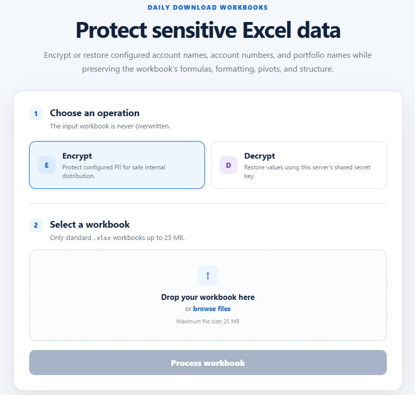
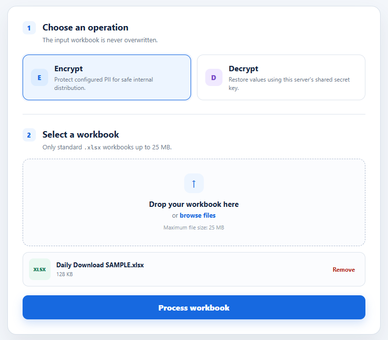
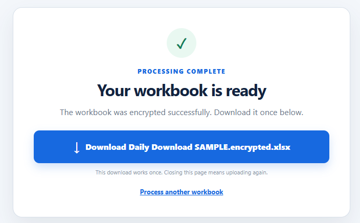
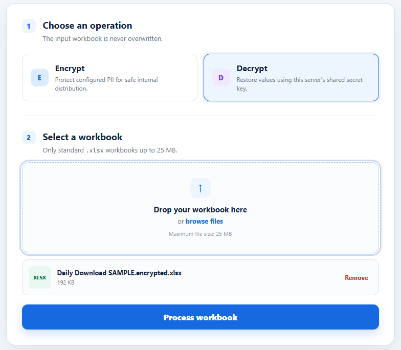
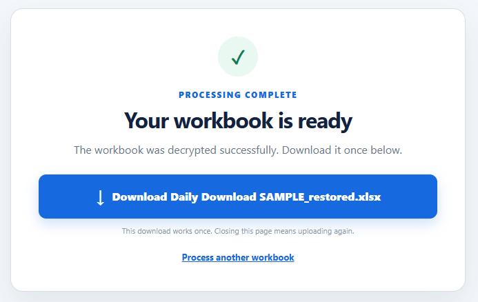
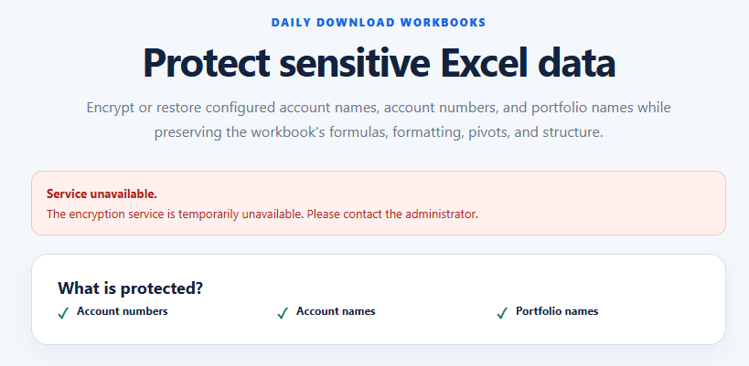

# XLSX PII Scrubber Web App

This is a standalone FastAPI and Jinja2 application for encrypting and
decrypting selected PII values inside `.xlsx` workbooks, plus
local find-and-replace processing for `.xlsx`, exported Google Docs `.docx`,
and `.pdf` files. It contains its own web UI, key loading, encryption logic,
Office XML processing, static assets, and tests.

The application preserves formulas, styles, drawings, pivot definitions, pivot
caches, shared strings, and other workbook package members. It never overwrites
the uploaded workbook.

Google Docs are handled as local `.docx` exports. Native `.gdoc` shortcut files
are not processed because they require Google Drive access, and this tool avoids
cloud dependencies.

## Requirements

Python 3.10+ is required, but you do not need to install it (or anything
else) yourself — the one-command setup below detects Python, installs it if
missing, and installs all application dependencies automatically.

## One-command setup

### Windows

From the extracted project folder, run:

```powershell
.\setup.ps1
```

### Mac/Linux

From the extracted project folder, run:

```bash
chmod +x setup.sh
./setup.sh
```

Each script checks for Python 3.10+ (installing it automatically if needed
via winget, Homebrew, or your Linux package manager), installs the
dependencies from `requirements.txt`, creates `.env` from `.env.example` if
it doesn't already exist, and generates a valid `SECRET_KEY` if one isn't
already set. No manual `pip install`, `.env` copying, or key generation is
needed — just re-run the script any time and it leaves an existing, valid
`.env`/`SECRET_KEY` untouched.

## Secret-key background

The application requires one URL-safe Base64-encoded 512-bit key stored as
`SECRET_KEY` in `.env`. `setup.ps1`/`setup.sh` create this automatically on
first run, so you normally never touch it directly — the details below are
for reference and recovery.

Keep this key unchanged for the lifetime of the encrypted workbooks. A new key
cannot decrypt files created with the previous key. Never regenerate the key
during an application update or restart.

When the setup script generates a new key, it offers a local **Copy Key**
action. Choosing copy places the generated key only on the local clipboard.
Choosing show prints it once in the local terminal. The setup script does not
transmit the key to any API or cloud service.

- Do not commit, email, print, or log the completed `.env` file.
- Grant read access only to the application service account and designated
  administrators.
- Keep a separately protected recovery copy in an organizational password
  manager or on BitLocker-encrypted removable media.
- Preserve `.env` when deploying a new application version.

## Development start

After running the one-command setup above, start the development server with
hot reload:

```powershell
python -m uvicorn app:app --host 127.0.0.1 --port 8000 --reload
```

```bash
python3 -m uvicorn app:app --host 127.0.0.1 --port 8000 --reload
```

Open `http://127.0.0.1:8000`. Uvicorn automatically restarts when Python files
change; refresh the browser to see template or static-file changes. Use these
commands only for local development.

## Web interface walkthrough

The home screen lets you choose whether to encrypt, decrypt, or replace values
only. Standard `.xlsx`, exported Google Docs `.docx`, and `.pdf` files up to
25 MB are accepted depending on the operation, and the uploaded source file is
never overwritten.



After selecting **Encrypt** and choosing a workbook, optionally add find and
replace rows, then select **Process workbook**. The application reads the
workbook locally and opens a column picker. Select only the fields that should
be encrypted, such as client names, account numbers, portfolio names, or any
other sensitive columns in that workbook.



When encryption succeeds, download the new `.encrypted.xlsx` workbook. The
download link is single-use; closing the page means the file must be uploaded
and processed again.



To restore a protected workbook, select **Decrypt**, choose its
`.encrypted.xlsx` file, and select **Process workbook**.



When decryption succeeds, use the single-use download button to save the
`.restored.xlsx` workbook.



If the encryption service is unavailable, encryption and decryption are disabled
and the page directs the user to contact an administrator. Replace-only
processing can still run because it does not use the secret key.



## Production start

Start one production worker without hot reload:

```powershell
python -m uvicorn app:app --host 127.0.0.1 --port 8000 --workers 1
```

Bind Uvicorn only to `127.0.0.1`. IIS should terminate HTTPS and proxy the
internal application URL to `http://127.0.0.1:8000`.

## Workbook scope

The application does not depend on fixed worksheet or column names.
During encryption, it discovers worksheet columns from the uploaded workbook
and encrypts only the columns selected in the UI. Pivot cache fields are
encrypted when their field names match selected column headers.

New encrypted Excel values use a readable prefix derived from the selected
column header, such as `client-name:<encrypted-value>`. Existing files that use
legacy prefixes such as `custom:<encrypted-value>` still decrypt with the same
secret key.

For worksheets with a title row above the table, the picker uses the densest
early row as the likely header row. Data below that header row is eligible for
encryption. The original uploaded workbook is left unchanged.

## Find and replace

Find and replace is optional for Excel encryption and required for **Replace
only**. Add one row for each sensitive value and its safe replacement, for
example:

```text
John Smith -> CLIENT_001
ABC Retirement Portfolio -> PORTFOLIO_001
```

Replacement is exact and case-sensitive. For Excel files, it is applied across
worksheet cells, shared strings, formulas, and pivot cache values in the output
workbook where applicable. For exported Google Docs `.docx` files, it is applied
to document body text, headers, footers, footnotes, endnotes, and comments where
present. For PDFs, PyMuPDF performs local redaction-style replacement and writes
a new PDF file. PDF replacement uses the matched text's font size and color
where PyMuPDF can read them. Blank or incomplete replacement rows are rejected
before processing.

Because replacement runs before encryption, decrypting an encrypted Excel output
restores the safe replacement labels, not the original sensitive values. Keep
the unchanged source file only in the approved internal location if the
originals must be retained.

PDF replacement depends on text search. Scanned image-only PDFs require OCR
before this tool can find text.

## Key management

The web application loads `SECRET_KEY` from `.env` at startup and uses it for
local encryption and decryption. The key is not included in workbook downloads,
logged, or sent to external services.

### Copy secret key button

Every page shows a floating **Copy secret key** button. It calls the
`POST /secret-key` endpoint and places `SECRET_KEY` on the clipboard of the
machine running the browser. The key is never drawn into the page, but it is
sent to the browser in the response body.

This means the key is exposed in the browser UI by design. Note before
deploying:

- The application has no login. Anyone who can reach the app can read the key
  that decrypts every workbook the app has produced.
- The key cannot be rotated to recover from disclosure. A new key cannot
  decrypt files created with the previous key, so a leak permanently exposes
  every existing `.encrypted.xlsx`.
- The endpoint is `POST`-only and requires the matching CSRF token, and the
  CSRF cookie is `SameSite=Strict`, so another website cannot trigger it. This
  protects against cross-site use, not against a person who can open the app.
- Restricting the endpoint by client IP does not work behind the documented
  IIS deployment. IIS proxies to `127.0.0.1`, so every remote request arrives
  from localhost.

If the goal is only to store a recovery copy of the key, prefer the terminal:
`setup.ps1` and `setup.sh` both offer a local **Copy Key** action that never
sends the key over HTTP.

Administrators should generate the key once, store it in `.env`, keep one
separately protected recovery copy, and preserve the same key for as long as
encrypted workbooks may need to be restored.

## File lifecycle

Uploads use random server-side filenames and are deleted immediately after
processing. A successful result is available through a single-use Download
button. Starting the download consumes its token and deletes the job after the
response. Closing the result page provides no recovery route; abandoned output
is removed automatically.
